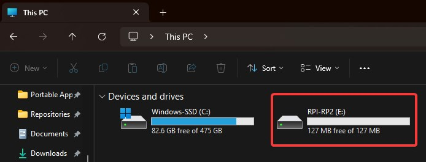

# More More Keypad! Firmware

This folder contains the Arduino-based firmware for the [More More Keypad!](https://github.com/Ace4896/cloverpad-hardware), a 3-key analog keypad for osu! themed after [MORE MORE JUMP!](https://www.sekaipedia.org/wiki/MORE_MORE_JUMP!) from Project Sekai.

## Installing Firmware

To install new firmware:

- Download the `firmware.uf2` file from [releases](https://github.com/Ace4896/cloverpad-hardware-software/releases)
- Plug the PCB into your PCB while holding down the `SEL` button
  - **NOTE**: If you're using a Raspberry Pi Pico, hold down the `BOOTSEL` button instead
- After doing this, the keypad should appear on your PC as a storage device:

- Copy this `firmware.uf2` file to the storage device

## Setting Up Development Environment

The firmware project is setup using PlatformIO and the Arduino-Pico framework. Install the following:

- [VS Code](https://code.visualstudio.com/)
- [PlatformIO Extension for VS Code](https://platformio.org/)

Some additional setup is also needed depending on which OS you're using:

- Windows:
  - [Long file paths need to be enabled](https://arduino-pico.readthedocs.io/en/latest/platformio.html#important-steps-for-windows-users-before-installing)
  - [Use WinUSB drivers for bootloader interface](https://github.com/earlephilhower/arduino-pico/issues/520)
- Linux:
  - `udev` rules need to be setup for PlatformIO and the keypads for this project:
    - Download a copy of the `udev` rules for [PlatformIO](https://docs.platformio.org/en/latest/core/installation/udev-rules.html)
    - Make a copy of the `udev` rules for [this project](./udev/99-cloverpad.rules)
    - Copy both `.rules` files into `/etc/udev/rules.d`
    - Restart udev: `sudo udevadm control --reload-rules && sudo udevadm trigger`

Then open this `firmware` folder in VS Code to initialise the PlatformIO project.

### Uploading Compiled Firmware via PlatformIO

If you're installing this firmware on your Pico or Keypad PCB for the first time, you'll need to build and upload the contents manually. Otherwise, PlatformIO will fail to upload the compiled firmware to the PCB. You only need to do this once (or if you install any non-Arduino firmware).

- Open VS Code in the `firmware` folder to initialise the PlatformIO project locally
- In the PlatformIO tab on the sidebar, expand the `harukapad-dev` category and run `Build`:

- In the File Explorer tab on the sidebar, there should be a `.pio` folder
  - Navigate to `.pio/build/harukapad-dev` and locate the `firmware.uf2` file
  - Right click `firmware.uf2` and reveal in file explorer

Then follow the instructions [above for installing the firmware](#installing-firmware) using this `firmware.uf2` instead of one from GitHub releases.
